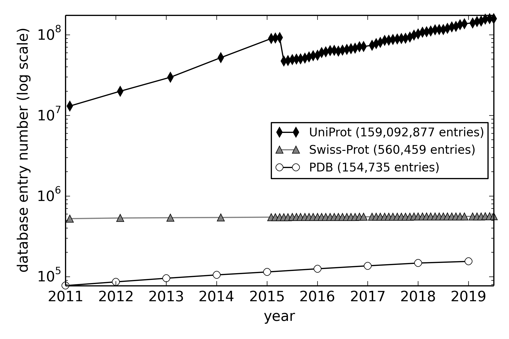
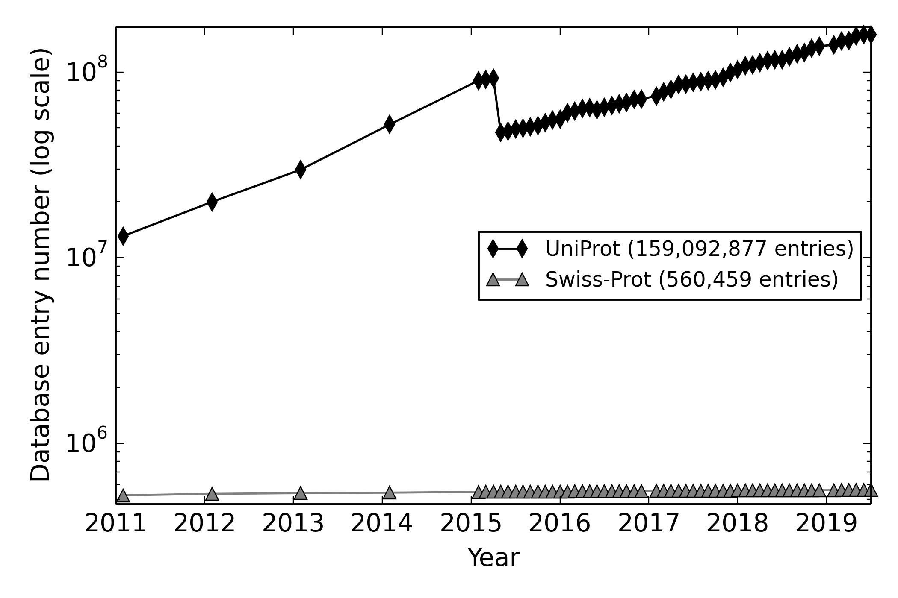
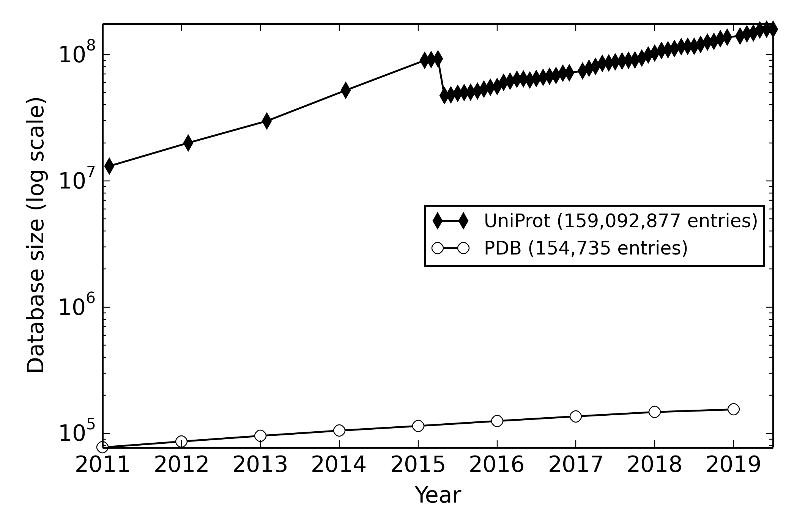

This folder makes statistics plot for UniProt vs PDB

Updating raw data
```bash
./retrieve_uniprot.sh # update uniprot.stat
./retrieve_pdb.sh     # update pdb.stat
```

Plotting image
```bash
./plot_all3_figure.py
```


```bash
./plot_uniprot_figure.py
```


```bash
./plot_pdb_figure.py
```

